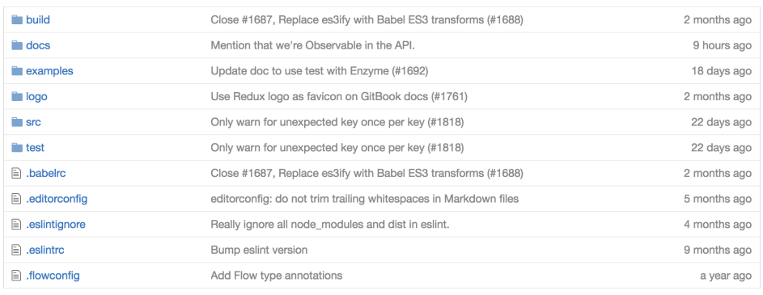
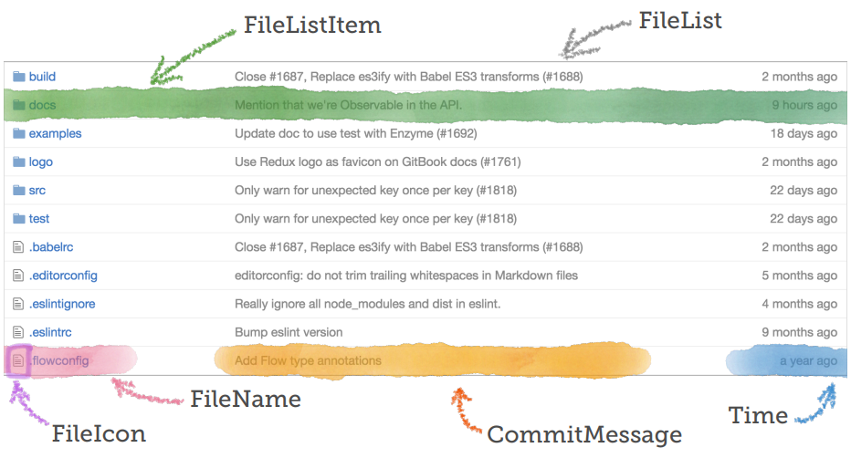
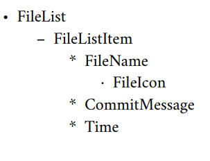

# React component that replicates GitHub's file list

This is a React Component that displays a list of files with their names, commit messages, and relative time they were modified. This is one of the components I made along my journey in learning React. This project covers all the basic concepts in React like one way data flow, props, state, ___________
 
 Here is an example of the final component in action - 

## Development Process
This section contains some details about how I went about building the component.

####1. Designing and Breaking down into components
First, a rough sketch was made of what the intended result was and then it was broken down further into child components that did one specific tasks so that they could be reused again. 
 

####2. Establishing the hierarchy between components (Parent - Child relationships)
For our case, this can be the hierarchy between the components -
 

### Building the components 
We shall build the components top-down, i.e. starting from FileList and working our way down to the child components. 
#### 1. FileListx

## Running the project

This project was bootstrapped with [Create React App](https://github.com/facebook/create-react-app).
    

In the project directory, you can run:

### `npm start`

Runs the app in the development mode. 
Open [http://localhost:3000](http://localhost:3000) to view it in the browser.

The page will reload if you make edits. 
You will also see any lint errors in the console.

### `npm run build`

Builds the app for production to the `build` folder. 
It correctly bundles React in production mode and optimizes the build for the best performance.

The build is minified and the filenames include the hashes. 
Your app is ready to be deployed!
